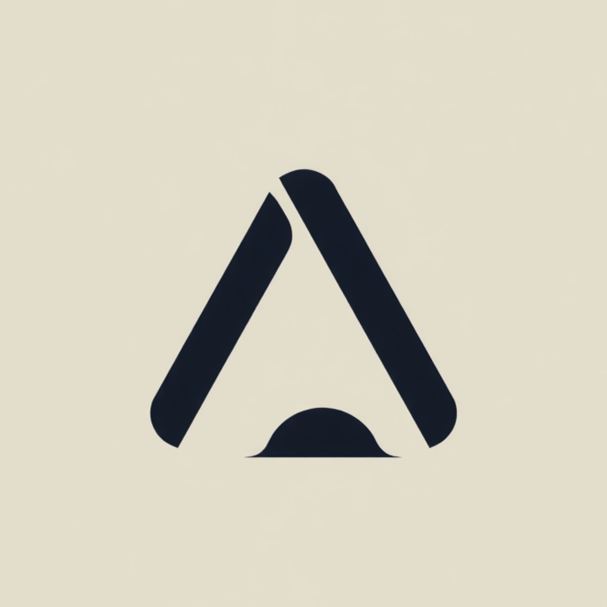

 

  

  

<a href="#-the-name">The Name</a> ·
<a href="#-manifesto">Manifesto</a> ·
<a href="#-what-we-believe">Philosophy</a> ·
<a href="#-what-were-building">Products</a> ·
<a href="#-the-long-horizon">Roadmap</a> ·
<a href="#-join-the-horizon">Careers</a> ·
<a href="#-reach-us">Contact</a>

 

## &nbsp;🌌&nbsp; The Name

<table width="100%">
<tr>
<td width="18%" align="center" valign="middle">

<h1>আকাশ</h1>
<i>a·kash</i>

</td>
<td width="82%" valign="middle">

In Assamese, <b>Aaxax</b> (আকাশ) means <b>sky</b> — the one thing every
person on earth can look up and see, and the one thing none of them can
ever fully reach.

That tension is the whole company. We build artificial intelligence the
way you'd study the sky: with patience, with precision, and with the
quiet understanding that the horizon moves every time you get closer to it.

</td>
</tr>
</table>

 

## &nbsp;🕊️&nbsp; Manifesto

 

<table width="100%"><tr><td>

> *We do not chase trends. We do not ship for applause.*
> *We build the way the sky moves — slowly, immensely, and without asking permission.*
>
> *Every model we train, every product we ship, every line we write is a small*
> *attempt to move the horizon one degree further than where we found it.*
>
> *We are not in a hurry. We are in it for the distance.*

</td></tr></table>

 

<b>&nbsp;✦&nbsp; Read the full manifesto</b>

 

<table width="100%"><tr><td>

**On Depth.**
Most of the industry is optimizing for the next demo. We are optimizing
for the next decade. That means slower launches, longer research cycles,
and a refusal to confuse *shipped* with *finished*.

**On Silence.**
We don't narrate our roadmap in public. We let the work speak when it's
ready to speak — not a moment before, and never through noise.

**On Honesty.**
An intelligent system that doesn't know the edges of its own knowledge
is not intelligent — it's confident. We build for the former, and we are
suspicious of the latter.

**On Horizons.**
There is no final version of Aaxax. Every milestone we hit becomes the
new floor, not the ceiling. The sky doesn't have an edge, and neither
does the work.

</td></tr></table>

 

 

## &nbsp;✦&nbsp; What We Believe

 

<table align="center" width="100%">
<tr>
<td width="25%" align="center" valign="top">

<h3>🧭 Depth over Speed</h3>
We'd rather ship one thing that lasts a decade than ten that don't survive the quarter.
</td>
<td width="25%" align="center" valign="top">

<h3>🕊️ Quiet Confidence</h3>
The work should announce itself. We rarely need to.
</td>
<td width="25%" align="center" valign="top">

<h3>🪞 Honest Intelligence</h3>
Systems that know the shape of what they don't know.
</td>
<td width="25%" align="center" valign="top">

<h3>🌌 No Ceiling</h3>
Every horizon we reach becomes the new starting line.
</td>
</tr>
</table>

 

 

## &nbsp;🪐&nbsp; What We're Building

 

The runtime layer that lets our systems reason, plan, and act reliably in the
real world — model-agnostic, latency-obsessed, and built to disappear
into the background of whatever you're building.

 

Our internal framework for understanding <i>why</i> a system succeeded or
failed — not just whether it did. Interpretability isn't an afterthought
here; it's load-bearing.

 

The layer people actually touch. Calm, legible, and unhurried design for
tools that make advanced AI feel like a conversation, not a control panel.

 

Research, prototypes, and the unfinished, half-mad ideas that eventually
grow up into products. Not everything here survives contact with reality
— and that's the point.

 

 

## &nbsp;🗺️&nbsp; The Long Horizon

 

<table align="center" width="90%">
<tr><td width="15%" align="center"><b>2026</b></td><td width="85%">Aaxax founded on a single premise — intelligence should keep reaching. Core research begins in earnest.</td></tr>
<tr><td align="center"><b>Now</b></td><td>Building in quiet — Core, Cortex, and Studio taking shape behind the scenes.</td></tr>
<tr><td align="center"><b>Next</b></td><td>First public releases reach the people who've been waiting for something that lasts.</td></tr>
<tr><td align="center"><b>Beyond</b></td><td>Wherever the horizon has moved to by then. We'll let you know when we get there.</td></tr>
</table>

 

 

## &nbsp;🌅&nbsp; Join the Horizon

 

 

We're a small, deliberate team, and we're always quietly looking for
people who think in decades rather than sprints — the kind of people who
would rather understand a problem completely than ship around it.

 

 

 

## &nbsp;📡&nbsp; Reach Us

 

  

<i>© 2026 Aaxax AI &nbsp; · &nbsp; Always Beyond The Horizons &nbsp; · &nbsp; 🌌</i>

